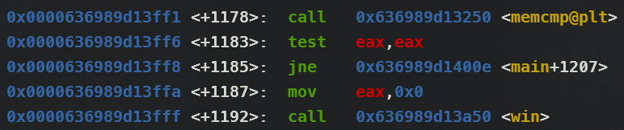

# Reverse Engineering

## Level 1

Khi ta chạy chương trình và nhập một random string nó sẽ hiện ra kết qua như hình dưới:

<figure><figcaption></figcaption></figure>

Ta thấy rằng **`expected result`** của nó là: **`63 6c 6a 79 62`**. Vậy hãy thử **`hex2text`**:&#x20;

<figure><figcaption></figcaption></figure>

Lấy output đó nhập vào ta sẽ được flag

Flag: **`pwn.college{8kyFgR3LKyAWjWjk-EHKlo_1ymY.0VM1IDL1MTNzYzW}`**

## Level 1.1

Ở level này đặc biệt hơn là nó không còn cho ta biết **`expected result`** khi ta nhập một random string vào nữa

Nhưng chúng ta có thể dùng **`strings`** để đọc được các chuỗi có thể đọc được từ binary đó

<figure><figcaption></figcaption></figure>

Flag: **`pwn.college{shXAwbbId8nfmnUnQ1FZkBbh1nK.0lM1IDL1MTNzYzW}`**

## Level 2

> This challenge is now mangling your input using the `swap` mangler for indexes `0` and `4`

<figure><figcaption></figcaption></figure>

Với hint trên ta có thể lấy **expected result** là **`78 70 69 7a 62`** swap index **0** và **4** với nhau để ra được **input** của chương trình (chương trình sẽ swap input ta nhập vào và **final result** sẽ giống với **expected result**)

Nên chuỗi **input** sẽ là: **62 70 69 7a 78**. **Hex2text** nó và ta sẽ có được **input** nhập vào rồi lấy flag thôi

Flag: **`pwn.college{Mj8hls6NslXd2v3IWogUy9MZXHy.01M1IDL1MTNzYzW}`**

## Level 2.1

Do bài này không có quá nhiều thông tin, nên chúng ta sẽ tải nó về và đưa nó lên IDA để phân tích

```c
void __fastcall __noreturn main(int a1, char **a2, char **a3)
{
  char v3; // [rsp+20h] [rbp-10h]
  int buf; // [rsp+22h] [rbp-Eh] BYREF
  __int16 v5; // [rsp+26h] [rbp-Ah]
  unsigned __int64 v6; // [rsp+28h] [rbp-8h]

  v6 = __readfsqword(0x28u);
  if ( a1 <= 0 )
    __assert_fail("argc > 0", "<stdin>", 0x32u, "main");
  puts("###");
  printf("### Welcome to %s!\n", *a2);
  puts("###");
  putchar(10);
  setvbuf(stdin, 0LL, 2, 0LL);
  setvbuf(stdout, 0LL, 2, 1uLL);
  puts(
    "This license verifier software will allow you to read the flag. However, before you can do so, you must verify that you");
  puts("are licensed to read flag files! This program consumes a license key over stdin. Each program may perform entirely");
  puts(
    "different operations on that input! You must figure out (by reverse engineering this program) what that license key is.");
  puts("Providing the correct license key will net you the flag!\n");
  buf = 0;
  v5 = 0;
  puts("Ready to receive your license key!\n");
  read(0, &buf, 5uLL);
  v3 = HIBYTE(buf);
  HIBYTE(buf) = v5;
  LOBYTE(v5) = v3;
  puts("Checking the received license key!\n");
  if ( !memcmp(&buf, aGsqcw, 5uLL) )
  {
    sub_12E9();
    exit(0);
  }
  puts("Wrong! No flag for you!");
  exit(1);
}
```

Như chúng ta thấy hàm main sẽ thay đổi vị trí của **input** chúng ta, nhưng điều quan trọng là nó thay đổi vị trí nào trong **input**. Với dữ kiện đã có được thì ta biết rằng nó sẽ **hoán đổi LOBYTE của v5 với HIBYTE ban đầu của buf.** Nó giống như:

```c
temp = a 
a = b 
b = temp
```

Với **v3** là **temp** và **HIBYTE(buf)** và **v5** là **a,b**

Với logic trên ta cần tìm **LOBYTE** và **HIBYTE** của **input** ta nhập vào:

```python
def get_lobyte(value):
    return value & 0xFF  # Lấy 8 bit thấp

def get_hibyte(value):
    return value >> 8 & 0xFF  # Đẩy 8 bit cao vào 8 bit thấp để lấy 8 bit cao

value = 0x6773716377 # gsqcw -> echo "gsqcw" | xxd -r 
lobyte = get_lobyte(value)
hibyte = get_hibyte(value)

print(f'Value: {value:X}')
print(f'LOBYTE: {lobyte:X}')
print(f'HIBYTE: {hibyte:X}')
```

```
Value: 6773716377 # 67 73 71 63 77
LOBYTE: 77        # Index: 4
HIBYTE: 63        # Index: 3
```

Như vậy ta có thể thấy nó hoán đổi 2 index cuối với nhau và cứ thế **excepted result** là **`gsqcw`** và input là **`gsqwc`**(do có 5 bytes thôi nên cũng dễ tách nhưng nếu nhiều quá không xác định được index bao nhiêu thì có thể đưa lên gpt làm hộ :p)

Flag: **`pwn.college{0oEWJ5R0rSCadGmjvDf11uAisj_.0FN1IDL1MTNzYzW}`**

## Level 3

```python
hex_string = "62 67 6e 72 74"

reverse_string = hex_string.split()[::-1]
ascii_string = ''.join(chr(int(h,16)) for h in reverse_string)

print(f'Reverse string: {reverse_string}')
print(f'ASCII string: {ascii_string}')
```

Đoạn code mình viết giúp chia các phần tử của **hex\_string** thành 1 array dựa trên khoảng trắng và đảo ngược chúng, và rồi gộp các kí tự đó lại và convert sang ASCII

```python
Reverse string: ['74', '72', '6e', '67', '62']
ASCII string: trngb
```

Flag: **pwn.college{0E8g\_UAu7t5uYNSr3T31rmXMuZu.0VN1IDL1MTNzYzW}**

## Level 3.1

```python
# hex_string = "62 67 6e 72 74"
string = 'xfrzq'

reverse_string = string[::-1]
# ascii_string = ''.join(chr(int(h,16)) for h in reverse_string)

print(f'Reverse string: {reverse_string}')
# print(f'ASCII string: {ascii_string}')
```

```
Reverse string: qzrfx
```

Flag: **`pwn.college{cqYmUUnnOvMaTxlfUnj8Kyy9CU2.0lN1IDL1MTNzYzW}`**

## Level 4

> This challenge is now mangling your input using the `sort` mangler

Flag: **`pwn.college{ccV9YvFxfSo5FBO9HkWuuxadUZe.01N1IDL1MTNzYzW}`**

## Level 4.1

Dùng **strings** và có được **ioprx**

<pre class="language-python"><code class="lang-python">string = 'ioprx'

hex_string = ' '.join(format(ord(char), '02X') for char in string)
# Chuyển thành list để sort vì nếu không thì nó sẽ sort các kí tự riêng lẻ chứ không phải là cặp kí tự của hex
<strong>hex_list = hex_string.split() 
</strong>sorted_hex_list = sorted(hex_list) # Sắp xếp các cặp kí tự
sorted_hex_string = ' '.join(sorted_hex_list)

print(f'Hex string: {hex_string}')
print(f'Sorted: {sorted_hex_string}')
</code></pre>

```
Hex string: 69 6F 70 72 78
Sorted: 69 6F 70 72 78
```

Vì **`ioprx`** đã sort rồi nên khi ta dùng nó để nhập vào thì nó vẫn không thay đổi nên ta có được flag

Flag: **`pwn.college{s61CuMgHQIzaMs-lFb35UfDlp5B.0FO1IDL1MTNzYzW}`**

## Level 5

> This challenge is now mangling your input using the `xor` mangler with key `0xbe`

Đề bài hint cho chúng ta nó sẽ sử dụng XOR với key là **`0xbe`**

Và khi chạy chương trình và nhập một chuỗi ngẫu nhiên ta sẽ được như này:

<figure><figcaption></figcaption></figure>

Như chúng ta đã thấy kết quả nó mong muốn là: **`ce cb c7 da d0`**

Với idea **`input ^ key = expected result`** thì bây giờ chúng ta sẽ làm ngược lại **`result ^ key = input`**

```python
def xor_mangler(data, key=0xbe):
    return bytes([byte ^ key for byte in data])

# Convert the hex sequence to bytes
expected_result = bytes.fromhex('ce cb c7 da d0')

# XOR with the key
key = 0xbe
mangled_data = xor_mangler(expected_result, key)

# Print results
print("Mangled Data:", mangled_data)
print("Mangled Data (Hex):", mangled_data.hex())
```

Flag: **`pwn.college{4adFuOl3PNV5mTD_lT-cbx1unU6.0VO1IDL1MTNzYzW}`**

## Level 5.1

Ý tưởng cũng khá giống với level 5 nhưng ở bài này nó không cho chúng ta biết expected result một cách dễ dàng. Điều ta cần là tải file đó về và sử dụng IDA

Mình có thiết kế một bash script để thuận tiện cho việc học sau này:

```bash
#!/bin/bash

if [ "$#" -ne 2 ]; then
    echo "Usage: $0 <remote_file_path> <local_output_file>"
    exit 1
fi

KEY_PATH="key"
REMOTE_USER="hacker"
REMOTE_HOST="pwn.college"
REMOTE_FILE_PATH="$1"
LOCAL_OUTPUT_FILE="$2"

scp -i "$KEY_PATH" "$REMOTE_USER@$REMOTE_HOST:$REMOTE_FILE_PATH" "$LOCAL_OUTPUT_FILE"

if [ $? -eq 0 ]; then
    echo "File has been successfully transferred to $LOCAL_OUTPUT_FILE"
else
    echo "File transfer failed"
fi

```



```c
void __fastcall __noreturn main(int a1, char **a2, char **a3)
{
  int i; // [rsp+2Ch] [rbp-14h]
  int buf; // [rsp+32h] [rbp-Eh] BYREF
  __int16 v5; // [rsp+36h] [rbp-Ah]
  unsigned __int64 v6; // [rsp+38h] [rbp-8h]

  v6 = __readfsqword(0x28u);
  if ( a1 <= 0 )
    __assert_fail("argc > 0", "<stdin>", 0x32u, "main");
  puts("###");
  printf("### Welcome to %s!\n", *a2);
  puts("###");
  putchar(10);
  setvbuf(stdin, 0LL, 2, 0LL);
  setvbuf(stdout, 0LL, 2, 1uLL);
  puts(
    "This license verifier software will allow you to read the flag. However, before you can do so, you must verify that you");
  puts("are licensed to read flag files! This program consumes a license key over stdin. Each program may perform entirely");
  puts(
    "different operations on that input! You must figure out (by reverse engineering this program) what that license key is.");
  puts("Providing the correct license key will net you the flag!\n");
  buf = 0;
  v5 = 0;
  puts("Ready to receive your license key!\n");
  read(0, &buf, 5uLL);
  for ( i = 0; i <= 4; ++i )
    *((_BYTE *)&buf + i) ^= 0xD0u;
  puts("Checking the received license key!\n");
  if ( !memcmp(&buf, &unk_4010, 5uLL) )
  {
    read_flag();
    exit(0);
  }
  puts("Wrong! No flag for you!");
  exit(1);
}
```



```c
unsigned __int64 read_flag()
{
  int *v0; // rax
  char *v1; // rax
  int *v2; // rax
  char *v3; // rax
  int fd; // [rsp+8h] [rbp-118h]
  int v6; // [rsp+Ch] [rbp-114h]
  _BYTE buf[264]; // [rsp+10h] [rbp-110h] BYREF
  unsigned __int64 v8; // [rsp+118h] [rbp-8h]

  v8 = __readfsqword(0x28u);
  puts("You win! Here is your flag:");
  fd = open("/flag", 0);
  if ( fd >= 0 )
  {
    v6 = read(fd, buf, 0x100uLL);
    if ( v6 > 0 )
    {
      write(1, buf, v6);
      puts("\n");
    }
    else
    {
      v2 = __errno_location();
      v3 = strerror(*v2);
      printf("\n  ERROR: Failed to read the flag -- %s!\n", v3);
    }
  }
  else
  {
    v0 = __errno_location();
    v1 = strerror(*v0);
    printf("\n  ERROR: Failed to open the flag -- %s!\n", v1);
    if ( geteuid() )
    {
      puts("  Your effective user id is not 0!");
      puts("  You must directly run the suid binary in order to have the correct permissions!");
    }
  }
  return __readfsqword(0x28u) ^ v8;
}
```



Ở main ta có thể thấy nó XOR với **`0xD0`** và check các ký tự với **unk\_4010** mình sẽ hiểu **`unk_4010`** là **`expected result`** vì nếu các kí tự so sánh giống thì nó sẽ chuyển sang hàm **`read_flag`**

<figure><figcaption></figcaption></figure>

Như idea của bài trước ở bài này ta tìm các kí tự trong **unk\_4010** tổng hợp nó lại vài đưa vào python để nó xử lý

<figure><figcaption></figcaption></figure>

```python
def xor_mangler(data, key):
    return bytes([byte ^ key for byte in data])

# Convert the hex sequence to bytes
expected_result = bytes.fromhex('A3 B5 B1 B4 A1')
# input_data = b"seadq"

# XOR with the key
key = 0xD0 
mangled_data = xor_mangler(expected_result, key)

# Print results
print("Mangled Data:", mangled_data)
print("Mangled Data (Hex):", mangled_data.hex())
```

Flag: **`pwn.college{EjCdWVFI11I6uewYQZACTrGQbXf.0FM2IDL1MTNzYzW}`**

## Level 6

> This challenge is now mangling your input using the `xor` mangler with key `0x67582f`
>
> This challenge is now mangling your input using the `sort` mangler.
>
> This challenge is now mangling your input using the `swap` mangler for indexes `11` and `17`.

Ở level này nó thực hiện theo quy trình: **input -> xor -> sort -> swap**&#x20;

Nên để tìm được input cần thiết ta làm ngược lại: **expected result -> swap -> sort -> xor**


<figure><figcaption></figcaption></figure>

Giải thích thêm một chút về việc tại sao lại đảo lại quy trình để tìm **input**. Để đơn giản hoá thì ta có thể tưởng tượng rằng nếu ta lấy **expected result** và biến đổi nó các thứ và bước cuối cùng là **XOR** để biến nó thành **input**. Và sau đó ta nhập input đó vào nó lại **XOR** thêm một lần nữa và từ đó biến **input** ta thành một chuỗi đã **SORT** trước kia sau đó đổi **index 11 và 17** lại từ đó ta lại có được **expected result**

&#x20;Cuối cùng dùng lệnh để có được flag:&#x20;

```bash
echo -e '\x65\x50\x24\x76\x45\x30\x47\x7A\x07\x4A\x68\x1D\x2A\x16\x7A\x30\x01\x70' | ./babyrev_level6.0
```

Flag: **`pwn.college{suf_KSTTojB09tiDjbETgk2EuJN.0VM2IDL1MTNzYzW}`**

## Level 6.1

Bài này đặc biệt ta không thể gdb để đặt **`breakpoint main`**  vì đây là một **stripped** binary. Tức là những symbol inform (như main) sẽ không có trong binary


"Stripped binary" là một tệp thực thi (binary file) đã được loại bỏ các thông tin không cần thiết như các symbol tables, debug information, và các thông tin khác phục vụ cho việc gỡ lỗi. Việc này giúp giảm kích thước tệp xuống, giúp nó chiếm ít bộ nhớ hơn và khó khăn hơn trong việc phân tích ngược (reverse engineering).&#x20;




```css
void __fastcall __noreturn main(int a1, char **a2, char **a3)
{
  int v3; // eax
  char temp; // [rsp+20h] [rbp-30h]
  char tmp; // [rsp+22h] [rbp-2Eh]
  int i; // [rsp+24h] [rbp-2Ch]
  int j; // [rsp+28h] [rbp-28h]
  int k; // [rsp+2Ch] [rbp-24h]
  __int64 input[2]; // [rsp+30h] [rbp-20h] BYREF
  __int16 v10; // [rsp+40h] [rbp-10h]
  unsigned __int64 v11; // [rsp+48h] [rbp-8h]

  v11 = __readfsqword(0x28u);
  if ( a1 <= 0 )
    __assert_fail("argc > 0", "<stdin>", 0x32u, "main");
  puts("###");
  printf("### Welcome to %s!\n", *a2);
  puts("###");
  putchar(10);
  setvbuf(stdin, 0LL, 2, 0LL);
  setvbuf(stdout, 0LL, 2, 1uLL);
  puts(
    "This license verifier software will allow you to read the flag. However, before you can do so, you must verify that you");
  puts("are licensed to read flag files! This program consumes a license key over stdin. Each program may perform entirely");
  puts(
    "different operations on that input! You must figure out (by reverse engineering this program) what that license key is.");
  puts("Providing the correct license key will net you the flag!\n");
  input[0] = 0LL;
  input[1] = 0LL;
  v10 = 0;
  puts("Ready to receive your license key!\n");
  read(0, input, 0x11uLL);
  for ( i = 0; i <= 16; ++i )
  {
    v3 = i % 3;
    if ( i % 3 == 2 )
    {
      *((_BYTE *)input + i) ^= 0xFDu;
    }
    else if ( v3 <= 2 )
    {
      if ( v3 )
      {
        if ( v3 == 1 )
          *((_BYTE *)input + i) ^= 0x58u;
      }
      else
      {
        *((_BYTE *)input + i) ^= 0xCEu;
      }
    }
  }
  for ( j = 0; j <= 7; ++j )
  {
    tmp = *((_BYTE *)input + j);
    *((_BYTE *)input + j) = *((_BYTE *)input + 16 - j);
    *((_BYTE *)input + 16 - j) = tmp;
  }
  for ( k = 0; k <= 7; ++k )
  {
    temp = *((_BYTE *)input + k);
    *((_BYTE *)input + k) = *((_BYTE *)input + 16 - k);
    *((_BYTE *)input + 16 - k) = temp;
  }
  puts("Checking the received license key!\n");
  if ( !memcmp(input, &expected_result, 0x11uLL) )
  {
    read_flag();
    exit(0);
  }
  puts("Wrong! No flag for you!");
  exit(1);
}
```



```c
unsigned __int64 read_flag()
{
  int *v0; // rax
  char *v1; // rax
  int *v2; // rax
  char *v3; // rax
  int fd; // [rsp+8h] [rbp-118h]
  int v6; // [rsp+Ch] [rbp-114h]
  char buf[264]; // [rsp+10h] [rbp-110h] BYREF
  unsigned __int64 v8; // [rsp+118h] [rbp-8h]

  v8 = __readfsqword(0x28u);
  puts("You win! Here is your flag:");
  fd = open("/flag", 0);
  if ( fd >= 0 )
  {
    v6 = read(fd, buf, 0x100uLL);
    if ( v6 > 0 )
    {
      write(1, buf, v6);
      puts("\n");
    }
    else
    {
      v2 = __errno_location();
      v3 = strerror(*v2);
      printf("\n  ERROR: Failed to read the flag -- %s!\n", v3);
    }
  }
  else
  {
    v0 = __errno_location();
    v1 = strerror(*v0);
    printf("\n  ERROR: Failed to open the flag -- %s!\n", v1);
    if ( geteuid() )
    {
      puts("  Your effective user id is not 0!");
      puts("  You must directly run the suid binary in order to have the correct permissions!");
    }
  }
  return __readfsqword(0x28u) ^ v8;
}
```





```python
# Dữ liệu hex từ hình ảnh của bạn
buf = [
    0x6C, 0x84, 0x64, 0x91, 0x67, 0x9A, 0x70, 0x95, 0x79,
    0x87, 0x70, 0x8F, 0x6E, 0x8E, 0x71, 0x84, 0x65, 0x91, 0x7E
]

for j in range(9):
    buf[j], buf[18 - j] = buf[18 - j], buf[j]

for i in range(19):
    if i % 2:
        buf[i] ^= 0xFE
    else:
        buf[i] ^= 9

buf[1], buf[15] = buf[15], buf[1]

print("Hex:", ' '.join(f"{byte:02X}" for byte in buf))
print("Text:", ''.join(chr(byte) if 32 <= byte <= 126 else '.' for byte in buf))
```



Flag: **`pwn.college{Eivnggum1pe0dlyHlJG1HufudiT.0lM2IDL1MTNzYzW}`**

## Level 7

Flag: **`pwn.college{05yfDLb5uAnSIEpmQGVPauKv3rl.01M2IDL1MTNzYzW}`**

## Level 7.1



```c
// local variable allocation has failed, the output may be wrong!
void __fastcall __noreturn main(int a1, char **a2, char **a3)
{
  int v3; // eax
  char v4; // [rsp+20h] [rbp-50h]
  char v5; // [rsp+22h] [rbp-4Eh]
  char v6; // [rsp+24h] [rbp-4Ch]
  char v7; // [rsp+26h] [rbp-4Ah]
  int i; // [rsp+28h] [rbp-48h]
  int j; // [rsp+2Ch] [rbp-44h]
  int k; // [rsp+30h] [rbp-40h]
  int m; // [rsp+34h] [rbp-3Ch]
  int n; // [rsp+38h] [rbp-38h]
  int ii; // [rsp+3Ch] [rbp-34h]
  char buf[64]; // [rsp+40h] [rbp-30h] OVERLAPPED BYREF

  *(_QWORD *)&buf[40] = __readfsqword(0x28u);
  if ( a1 <= 0 )
    __assert_fail("argc > 0", "<stdin>", 0x32u, "main");
  puts("###");
  printf("### Welcome to %s!\n", *a2);
  puts("###");
  putchar(10);
  setvbuf(stdin, 0LL, 2, 0LL);
  setvbuf(stdout, 0LL, 2, 1uLL);
  puts(
    "This license verifier software will allow you to read the flag. However, before you can do so, you must verify that you");
  puts("are licensed to read flag files! This program consumes a license key over stdin. Each program may perform entirely");
  puts(
    "different operations on that input! You must figure out (by reverse engineering this program) what that license key is.");
  puts("Providing the correct license key will net you the flag!\n");
  memset(buf, 0, 26);
  puts("Ready to receive your license key!\n");
  read(0, buf, 0x19uLL);
  for ( i = 0; i <= 24; ++i )
  {
    v3 = i % 3;
    if ( i % 3 == 2 )
    {
      buf[i] ^= 0x8Du;
    }
    else if ( v3 <= 2 )
    {
      if ( v3 )
      {
        if ( v3 == 1 )
          buf[i] ^= 0xF6u;
      }
      else
      {
        buf[i] ^= 0x95u;
      }
    }
  }
  for ( j = 0; j <= 11; ++j )
  {
    v7 = buf[j];
    buf[j] = buf[24 - j];
    buf[24 - j] = v7;
  }
  for ( k = 0; k <= 23; ++k )
  {
    for ( m = 0; m < 24 - k; ++m )              // 0 -> 23 - k
    {
      if ( (unsigned __int8)buf[m] > (unsigned __int8)buf[m + 1] )
      {
        v6 = buf[m];
        buf[m] = buf[m + 1];
        buf[m + 1] = v6;
      }
    }
  }
  for ( n = 0; n <= 11; ++n )
  {
    v5 = buf[n];
    buf[n] = buf[24 - n];
    buf[24 - n] = v5;
  }
  for ( ii = 0; ii <= 11; ++ii )
  {
    v4 = buf[ii];
    buf[ii] = buf[24 - ii];
    buf[24 - ii] = v4;
  }
  puts("Checking the received license key!\n");
  if ( !memcmp(buf, &unk_4010, 0x19uLL) )
  {
    sub_12E9();
    exit(0);
  }
  puts("Wrong! No flag for you!");
  exit(1);
}
```



```nasm
.data:0000000000004010 unk_4010        db  80h                 ; DATA XREF: main+363↑o
.data:0000000000004011                 db  8Ch
.data:0000000000004012                 db  92h
.data:0000000000004013                 db  93h
.data:0000000000004014                 db  94h
.data:0000000000004015                 db  95h
.data:0000000000004016                 db  97h
.data:0000000000004017                 db  98h
.data:0000000000004018                 db 0E2h
.data:0000000000004019                 db 0E2h
.data:000000000000401A                 db 0E2h
.data:000000000000401B                 db 0E3h
.data:000000000000401C                 db 0E4h
.data:000000000000401D                 db 0E6h
.data:000000000000401E                 db 0EBh
.data:000000000000401F                 db 0EBh
.data:0000000000004020                 db 0EDh
.data:0000000000004021                 db 0EFh
.data:0000000000004022                 db 0EFh
.data:0000000000004023                 db 0F0h
.data:0000000000004024                 db 0FBh
.data:0000000000004025                 db 0FCh
.data:0000000000004026                 db 0FDh
.data:0000000000004027                 db 0FFh
.data:0000000000004028                 db 0FFh
.data:0000000000004029                 db    0
```



```python
buf = [
    0x73, 0x98, 0xAC, 0x7E, 0x66, 0xB3, 0x7A, 0x90, 0xA9,
    0x7B, 0x8F, 0xB7, 0x94, 0x8D, 0xB4, 0x66, 0x8B, 0xB2,
    0x79, 0x8A, 0xBE, 0x6D, 0x84, 0xBA, 0x6A
]

buf[4], buf[12] = buf[12], buf[4]

for m in range(12):
    buf[m], buf[24 - m] = buf[24 - m], buf[m]

for k in range(25):
    v3 = k % 3
    if v3 == 2:
        buf[k] ^= 0xE0
    elif v3 <= 2:
        if v3 == 1:
            buf[k] ^= 0xD9
        elif v3 == 0:
            buf[k] ^= 0x0B

buf[6], buf[19] = buf[19], buf[6]

for i in range(24):
    for j in range(24 - i):
        if buf[j] > buf[j + 1]:
            buf[j], buf[j + 1] = buf[j + 1], buf[j]

print("Hex:", ' '.join(f"{byte:02X}" for byte in buf))
print("Text:", ''.join(chr(byte) if 32 <= byte <= 126 else '.' for byte in buf))
```



Flag: **`pwn.college{oHNJAB-upb1vSShGEjUt8GyO0YK.0FN2IDL1MTNzYzW}`**

## Level 8

Flag: **`pwn.college{InKz_0aV58bXklO7rbon2ojv6O9.0VN2IDL1MTNzYzW}`**

## Level 8.1



```c
// local variable allocation has failed, the output may be wrong!
void __fastcall __noreturn main(int a1, char **a2, char **a3)
{
  char v3; // [rsp+24h] [rbp-5Ch]
  char v4; // [rsp+26h] [rbp-5Ah]
  char v5; // [rsp+28h] [rbp-58h]
  char v6; // [rsp+2Ah] [rbp-56h]
  char v7; // [rsp+2Ch] [rbp-54h]
  char v8; // [rsp+2Eh] [rbp-52h]
  int i; // [rsp+30h] [rbp-50h]
  int j; // [rsp+34h] [rbp-4Ch]
  int k; // [rsp+38h] [rbp-48h]
  int m; // [rsp+3Ch] [rbp-44h]
  int n; // [rsp+40h] [rbp-40h]
  int ii; // [rsp+44h] [rbp-3Ch]
  int jj; // [rsp+48h] [rbp-38h]
  int kk; // [rsp+4Ch] [rbp-34h]
  char buf[64]; // [rsp+50h] [rbp-30h] OVERLAPPED BYREF

  *(_QWORD *)&buf[40] = __readfsqword(0x28u);
  setvbuf(stdin, 0LL, 2, 0LL);
  setvbuf(stdout, 0LL, 2, 0LL);
  puts("###");
  printf("### Welcome to %s!\n", *a2);
  puts("###");
  putchar(10);
  puts(
    "This license verifier software will allow you to read the flag. However, before you can do so, you must verify that you");
  puts("are licensed to read flag files! This program consumes a license key over stdin. Each program may perform entirely");
  puts(
    "different operations on that input! You must figure out (by reverse engineering this program) what that license key is.");
  puts("Providing the correct license key will net you the flag!\n");
  memset(buf, 0, 39);
  puts("Ready to receive your license key!\n");
  read(0, buf, 0x26uLL);
  for ( i = 0; i <= 18; ++i )
  {
    v8 = buf[i];
    buf[i] = buf[37 - i];
    buf[37 - i] = v8;
  }
  for ( j = 0; j <= 36; ++j )
  {
    for ( k = 0; k < 37 - j; ++k )
    {
      if ( (unsigned __int8)buf[k] > (unsigned __int8)buf[k + 1] )
      {
        v7 = buf[k];
        buf[k] = buf[k + 1];
        buf[k + 1] = v7;
      }
    }
  }
  for ( m = 0; m <= 18; ++m )
  {
    v6 = buf[m];
    buf[m] = buf[37 - m];
    buf[37 - m] = v6;
  }
  for ( n = 0; n <= 18; ++n )
  {
    v5 = buf[n];
    buf[n] = buf[37 - n];
    buf[37 - n] = v5;
  }
  for ( ii = 0; ii <= 18; ++ii )
  {
    v4 = buf[ii];
    buf[ii] = buf[37 - ii];
    buf[37 - ii] = v4;
  }
  for ( jj = 0; jj <= 18; ++jj )
  {
    v3 = buf[jj];
    buf[jj] = buf[37 - jj];
    buf[37 - jj] = v3;
  }
  for ( kk = 0; kk <= 37; ++kk )
  {
    switch ( kk % 5 )
    {
      case 0:
        buf[kk] ^= 0x3Fu;
        break;
      case 1:
        buf[kk] ^= 0x43u;
        break;
      case 2:
        buf[kk] ^= 0x4Eu;
        break;
      case 3:
        buf[kk] ^= 0x15u;
        break;
      case 4:
        buf[kk] ^= 0x98u;
        break;
      default:
        continue;
    }
  }
  puts("Checking the received license key!\n");
  if ( !memcmp(buf, &unk_4020, 0x26uLL) )
  {
    sub_12A9();
    exit(0);
  }
  puts("Wrong! No flag for you!");
  exit(1);
}
```



```c
int sub_12A9()
{
  int *v0; // rax
  char *v1; // rax
  int *v2; // rax
  char *v3; // rax

  puts("You win! Here is your flag:");
  fd = open("/flag", 0);
  if ( fd < 0 )
  {
    v0 = __errno_location();
    v1 = strerror(*v0);
    printf("\n  ERROR: Failed to open the flag -- %s!\n", v1);
    if ( geteuid() )
    {
      puts("  Your effective user id is not 0!");
      puts("  You must directly run the suid binary in order to have the correct permissions!");
    }
    exit(-1);
  }
  dword_41A0 = read(fd, &unk_40A0, 0x100uLL);
  if ( dword_41A0 <= 0 )
  {
    v2 = __errno_location();
    v3 = strerror(*v2);
    printf("\n  ERROR: Failed to read the flag -- %s!\n", v3);
    exit(-1);
  }
  write(1, &unk_40A0, dword_41A0);
  return puts("\n");

```



```python
buf = [
    0x5E, 0x22, 0x2C, 0x77, 0xFC, 0x5A, 0x25, 0x28, 0x72, 0xFF, 0x56, 0x29,
    0x24, 0x7F, 0xF3, 0x53, 0x2E, 0x23, 0x7B, 0xF6, 0x50, 0x32, 0x3F, 0x64,
    0xEA, 0x4D, 0x31, 0x3C, 0x66, 0xEB, 0x4B, 0x37, 0x3B, 0x63, 0xE1, 0x46,
    0x39, 0x34
]

for kk in range(38):
    if kk % 5 == 0:
        buf[kk] ^= 0x3F
    elif kk % 5 == 1:
        buf[kk] ^= 0x43
    elif kk % 5 == 2:
        buf[kk] ^= 0x4E
    elif kk % 5 == 3:
        buf[kk] ^= 0x15
    elif kk % 5 == 4:
        buf[kk] ^= 0x98

for jj in range(19):
    buf[jj], buf[37 - jj] = buf[37 - jj], buf[jj]

for ii in range(19):
    buf[ii], buf[37 - ii] = buf[37 - ii], buf[ii]

for n in range(19):
    buf[n], buf[37 - n] = buf[37 - n], buf[n]

for m in range(19):
    buf[m], buf[37 - m] = buf[37 - m], buf[m]

for j in range(37):
    for k in range(37 - j):
        if buf[k] > buf[k + 1]:
            buf[k], buf[k + 1] = buf[k + 1], buf[k]

for i in range(19):
    buf[i], buf[37 - i] = buf[37 - i], buf[i]

result = ''.join(chr(c) for c in buf)
print("Kết quả cuối cùng:", result)
```

Flag: **`pwn.college{YblAORR1y5vRj-74hBgAI2q9e6r.0lN2IDL1MTNzYzW}`**

## Level 9

Có thể thay đổi 1 byte như level 10

Flag: **`pwn.college{o4g1FLx1E52n6nHICfzJAu1LVmu.01N2IDL1MTNzYzW}`**

## Level 9.1

Áp dụng như level 9

Flag: **`pwn.college{07lxduKcoEZzH8kEmASJoTw-8V2.0FO2IDL1MTNzYzW}`**

## Level 10&#x20;

Ở bài này chúng ta được phép điều chỉnh 1 byte duy nhất

Hãy thử debug bằng gdb để xem nó như thế nào

Xem ra nó khá giống như Level 9, nhưng đôi phần dễ hơn vì chúng ta chỉ cần điều chỉnh 1 byte duy nhất

Vì thế các bước ở Level 9 dường như là bất khả thi ở đây, nhưng thay vào đó chúng ta có thể can thiệp vào điều kiện của lệnh **jmp**

<figure><figcaption></figcaption></figure>

Mặc định khi chúng ta nhập inout vào input sẽ bị MD5 mã hoá và so sánh nó với **expected result**, vì thế chúng ta có thể thay đổi từ **jne** thành **je**. Bằng cách này ta không cần đến input vẫn có thể có được flag

<figure><figcaption></figcaption></figure>

Và base address là: **`0x636989d12000`**

Ta có thể tính được **offset** bằng cách **0x0000636989d13ff8 - 0x636989d12000 = 0x1ff8**

Và rồi đưa nó vào binary thôi

```
printf "0x1ff8\n0x74\n0" | ./babyrev-level-10-0
```


Opcode của **je** là **0x74**


### Tìm offset và opcode trong IDA

<figure><figcaption></figcaption></figure>

Đối với **opcode** thì chúng ta có thể dùng **hex view** (chỉ đến address đó và qua **hex view** xem)

<figure><figcaption></figcaption></figure>

-> Do có **ASLR** nên trong **IDA** chỉ hiện **offset** đến hàm mà không hiện hẳn **absolute address**

Flag: **`pwn.college{I-o1GoNc-RVsvwFLlCb_tTe59Xm.0VO2IDL1MTNzYzW}`**

## Level 10.1

Giống như level 10

Flag: **`pwn.college{cwaCY-auM1_en0MOu7u7KXQqGsD.0FM3IDL1MTNzYzW}`**

## Read more

* More ways to solve challenges: [https://github.com/he15enbug/cse-365/blob/main/Reverse\_Engineering/Rev\_Eng\_Writeup.md](https://github.com/he15enbug/cse-365/blob/main/Reverse_Engineering/Rev_Eng_Writeup.md)
* Instruction opcodes: [http://ref.x86asm.net/coder64.html#x0F75](http://ref.x86asm.net/coder64.html#x0F75)
* Level 9 -> 10.1 explaination: [https://discord.com/channels/750635557666816031/1210435745509146655/1210440524318777385](https://discord.com/channels/750635557666816031/1210435745509146655/1210440524318777385)
